# 🚨 AI Crisis Commander

**Multi-Agent War Room for Real-Time Crisis Response — Powered by YOU.com**

> AI-driven crisis management that **replaces your first chaotic hour** with structured, cross-validated intelligence. 8 specialized agents run in parallel, disagree with each other, and produce executive-ready output in seconds — not hours.

[](https://ai-crisis-commander.vercel.app/) [](https://nextjs.org) [](https://you.com) [](https://deepgram.com) [](https://typescriptlang.org) [](./LICENSE)

**Key Capabilities:** Multi-Agent Orchestration · Parallel Execution · Cross-Validation · NIST SP 800-61 Lifecycle · Deterministic Risk Scoring · SEV Classification · Zod Schema Validation · Voice Input

---

## 📋 Table of Contents

1. [Problem Statement](#-problem-statement)
2. [Solution Overview](#-solution-overview)
3. [Architecture](#-architecture)
4. [Agent Pipeline Deep Dive](#-agent-pipeline-deep-dive)
5. [Scoring & Analytics](#-scoring--analytics)
6. [Safety & Explainability](#-safety--explainability)
7. [Local Setup](#-local-setup)
8. [Demo Walkthrough](#-demo-walkthrough)
9. [Project Structure](#-project-structure)
10. [Roadmap](#-roadmap)
11. [License](#-license)

---

## ❌ Problem Statement

When a crisis hits — data breach, outage, PR disaster — the first 60 minutes define the outcome. But here's what actually happens:

| Failure Mode | What Happens | Real-World Impact |
|---|---|---|
| **War Room Chaos** | 15 people on a call, nobody owns the narrative | First public statement delayed by hours |
| **Siloed Analysis** | Legal doesn't talk to PR, forensics ignores comms | Contradictory public statements |
| **Decision Paralysis** | No clear severity, no risk quantification | C-suite flies blind, wrong escalation level |
| **Missing Perspectives** | Only technical team responds, legal/PR/exec afterthought | Regulatory deadlines missed, brand damage |
| **No Cross-Check** | Nobody challenges assumptions or tests confidence | Overconfident response based on incomplete data |

Traditional incident response tools manage **tickets**. AI Crisis Commander manages **decisions**.

---

## ✅ Solution Overview

AI Crisis Commander is a **multi-agent incident war room** where 8 specialized AI agents analyze a crisis from every angle simultaneously:

- 🎙️ **Voice-activated crisis input** — describe what's happening naturally, or use pre-built demo scenarios
- 🧭 **8-agent parallel pipeline** — Router → 5 domain experts → Cross-Validator → Aggregator
- 🔀 **Cross-validation** — agents critique each other's output for conflicts, overconfidence, and missing evidence
- 📊 **Deterministic scoring** — risk scores and confidence computed algorithmically, not hallucinated
- 🛡️ **Decision robustness** — "If We're Wrong" analysis proves recommendations hold regardless of root cause
- ⏱️ **NIST SP 800-61 lifecycle** — maps crisis to standardized incident response phases
- 👁️ **Transparent execution** — watch agents think in real-time with expandable action logs
- 📣 **PagerDuty-grade escalation** — SEV-0 through SEV-3 with auto-classification
- 💬 **One-click Slack message** — formatted #incident-war-room post ready to paste
- 📄 **Board brief export** — print-optimized PDF for C-suite

**Every AI call goes through Zod schema validation. No free-form text. No hallucinated structure.**

---

## 🏗 Architecture

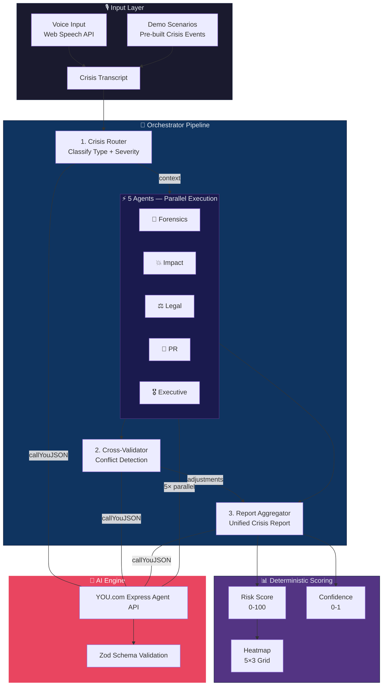

> Full architecture diagram: [`architecture.mmd`](./architecture.mmd)

---

## 🔍 Agent Pipeline Deep Dive

### Stage 1: Crisis Router — Classification

Classifies the crisis and extracts structured parameters for all downstream agents:

```typescript
// lib/prompts/router.ts
{
  "crisis_type": "DATA_BREACH|OUTAGE|PR_CRISIS|FRAUD|OTHER",
  "severity": "LOW|MEDIUM|HIGH|CRITICAL",
  "time_horizon": "NEXT_60_MIN|NEXT_24_HOURS|NEXT_7_DAYS",
  "key_facts": { "what_happened", "systems_affected", "regions_affected", ... },
  "assumptions": [...],
  "missing_information": [...],
  "agent_plan": [{ "agent", "priority", "why" }]
}
```

📁 [`lib/prompts/router.ts`](./lib/prompts/router.ts) — Decision rules: users/data/privacy → `DATA_BREACH`, downtime → `OUTAGE`, press/backlash → `PR_CRISIS`, payments → `FRAUD`.

### Stage 2: Domain Agents — Parallel Execution

Five specialized agents run simultaneously via `Promise.all`, each with distinct expertise:

| Agent | Role | Key Outputs |
|---|---|---|
| 🔬 **Forensics Lead** | Technical root cause analysis | Hypotheses (with likelihood), containment steps, evidence timeline |
| 💥 **Impact Estimator** | Operational + financial blast radius | User/record ranges, service impact, financial risk band |
| ⚖️ **Legal Advisor** | Compliance risk (NOT legal advice) | Notification considerations, liability hotspots, do/avoid lists |
| 📣 **PR Strategy** | Communications planning | Stakeholder plan, holding statement draft, Q&A prep |
| 🎖️ **Executive Brief** | C-suite decision support | 5-bullet summary, recommended decisions with options, top risks |

📁 [`lib/prompts/agents.ts`](./lib/prompts/agents.ts) — Each agent receives the router's `crisis_type`, `severity`, `key_facts`, and raw transcript.

```typescript
// lib/orchestrator.ts — Parallel execution
const [forensics, impact, legal, pr, exec] = await Promise.all([
    makeAgentCall("FORENSICS", forensicsPrompt, AgentForensicsSchema),
    makeAgentCall("IMPACT",    impactPrompt,    AgentImpactSchema),
    makeAgentCall("LEGAL",     legalPrompt,     AgentLegalSchema),
    makeAgentCall("PR",        prPrompt,        AgentPRSchema, 0.3),
    makeAgentCall("EXEC",      execPrompt,      AgentExecSchema),
]);
```

### Stage 3: Cross-Validation — Agent Critiques Agent

The Cross-Validator receives **all 5 agent outputs** and evaluates them for internal consistency:

```typescript
// lib/prompts/crosscheck.ts
{
  "conflicts": [{ "between": "PR vs LEGAL", "issue": "...", "risk": "HIGH", "fix": "..." }],
  "overconfident_claims": ["..."],
  "missing_evidence_flags": ["..."],
  "recommended_edits": [{ "target": "FORENSICS", "edit": "..." }],
  "confidence_adjustment": -0.10  // Applied to final confidence score
}
```

📁 [`lib/prompts/crosscheck.ts`](./lib/prompts/crosscheck.ts) — This is the key safety mechanism: if PR recommends immediate disclosure but Legal advises waiting for counsel review, the cross-validator **flags the conflict** with a resolution suggestion.

### Stage 4: Report Aggregation

The Aggregator merges all agent outputs into a single structured Crisis Report with 7 sections:

📁 [`lib/prompts/aggregator.ts`](./lib/prompts/aggregator.ts) — Produces: summary, action plan, forensics analysis, impact assessment, legal considerations, communications plan, and executive brief.

### AI Communication — YOU.com Express Agent API

All agent calls go through a single function with strict JSON enforcement:

```typescript
// lib/youClient.ts
const payload = {
    agent: "express",
    input: `${systemInstructions}\n\n---\n\n${agentPrompt}`,
    stream: false,
};
const res = await fetch("https://api.you.com/v1/agents/runs", { ... });
```

📁 [`lib/youClient.ts`](./lib/youClient.ts) — Markdown fence stripping, safe JSON parsing, and structured error reporting.

---

## 📊 Scoring & Analytics

### Risk Score (0–100) — Deterministic Algorithm

The risk score is **computed, not hallucinated**. No LLM decides the number:

```typescript
// lib/riskScore.ts
let score = 20; // base
if (severity === "CRITICAL")    score += 45;
if (crisis_type === "DATA_BREACH") score += 10;
if (financial_risk === "HIGH")  score += 5;
if (highLikelihoodRootCause)    score += 10;
// ... clamped to 0–100
```

| Factor | Contribution |
|---|---|
| Base score | 20 |
| Severity (LOW→CRITICAL) | 0 / 15 / 30 / 45 |
| User count (50k / million) | 10 / 20 |
| High-likelihood root cause exists | 10 |
| Crisis type (breach/outage/PR) | 10 / 8 / 6 |
| Financial risk band = HIGH | 5 |

📁 [`lib/riskScore.ts`](./lib/riskScore.ts)

### Confidence Score (0–1) — Missing Information Penalty

```typescript
const base = 0.85;
const penalty = missing_information.length * 0.05; // max 0.50
let confidence = Math.max(0.20, base - penalty);

// Cross-validator adjustment applied
confidence += crosscheck.confidence_adjustment; // e.g. -0.10
```

### Risk Heatmap — 5×3 Grid with Decay Model

| Category | 60 min | 24 hours | 7 days |
|---|---|---|---|
| 🔒 Security | 3/3 | 3/3 | 2/3 |
| ⚖️ Legal | 3/3 | 3/3 | 3/3 |
| 📣 PR | 2/3 | 3/3 | 2/3 |
| ⚙️ Operational | 3/3 | 2/3 | 1/3 |
| 👥 Customer | 3/3 | 3/3 | 2/3 |

📁 [`lib/heatmap.ts`](./lib/heatmap.ts) — Deterministic scoring from severity, crisis type, financial risk, and confidence with time-horizon decay.

---

## 🛡️ Safety & Explainability

AI Crisis Commander is built for **trust, not just speed**. Four safety mechanisms prevent AI failures:

### 1. Schema Enforcement — Zero Free-Form Output

Every AI response is validated through Zod schemas. If the LLM returns malformed JSON, the call **throws immediately** — no partial or garbled output reaches the UI.

```typescript
const router = RouterSchema.parse(routerRaw);  // Throws if invalid
const forensics = AgentForensicsSchema.parse(forensicsRaw);
```

📁 [`lib/schemas.ts`](./lib/schemas.ts) — 7 strict schemas covering every agent output type.

### 2. Cross-Validation — Agents Challenge Each Other

The Cross-Validator specifically looks for:
- **Conflicts** between agent recommendations (e.g., PR vs Legal on disclosure timing)
- **Overconfident claims** that lack supporting evidence
- **Missing evidence flags** — information gaps no agent flagged

If the cross-validator identifies issues, it applies a **confidence adjustment** (typically −5% to −15%).

### 3. Decision Robustness — "If We're Wrong"

The Confidence Panel includes a robustness section proving that recommendations remain valid even if assumptions are wrong:

> - "Containment steps still reduce blast radius regardless of root cause"
> - "PR holding statement remains safe regardless of breach scope"
> - "Legal notification timeline satisfies conservative interpretation"

### 4. Transparent Confidence Breakdown

Every result shows exactly why the system is confident (or not):

| Factor | Direction | Explanation |
|---|---|---|
| Clear severity classification | ✅ Positive | Router identified CRITICAL with supporting evidence |
| Specific user count mentioned | ✅ Positive | "50,000 users" gives precise blast radius |
| Missing forensic logs | ❌ Negative | No access logs provided, containment may be incomplete |
| Unverified assumptions | ❌ Negative | Assuming PII exposure without confirmation |

---

## 🛠️ Local Setup

### Prerequisites

- Node.js ≥ 18
- YOU.com API key ([get one here](https://you.com/api))

### Quick Start

```bash
# Clone and install
git clone https://github.com/manojmallick/ai-crisis-commander.git
cd ai-crisis-commander
npm install

# Configure API key
cp .env.local.example .env.local
# Edit .env.local and add your YOU_API_KEY

# Start development server
npm run dev
```

Opens at: **http://localhost:3000**

### Environment Configuration

```env
# .env.local
YOU_API_KEY=your_you_com_api_key_here
```

> **Note:** The app uses demo mode by default. Toggle "DEMO" in the header to use real AI analysis (requires API key).

---

## 📱 Application Overview

### 1. Crisis Input & Activation
Users can describe the crisis naturally via voice or select pre-built scenarios. The system immediately analyzes the intent and prepares the agent war room.
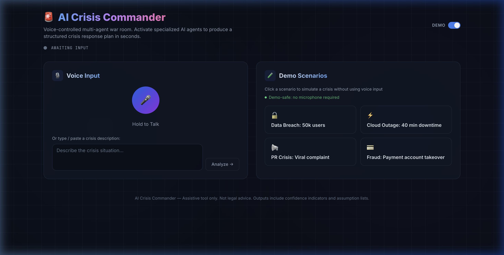

### 2. Agent War Room & Real-Time Logistics
8 specialized agents work in parallel. Use the **expandable logs (+)** to watch each agent's reasoning process in real-time as they classify, investigate, and strategize.
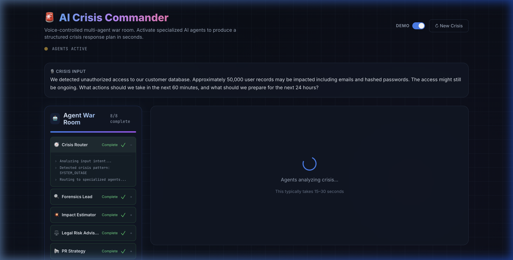

### 3. Comprehensive Crisis Report
The aggregated report provides a 360-degree view. Click the tabs to explore:

| **Summary** | **Action Plan** |
| :---: | :---: |
| 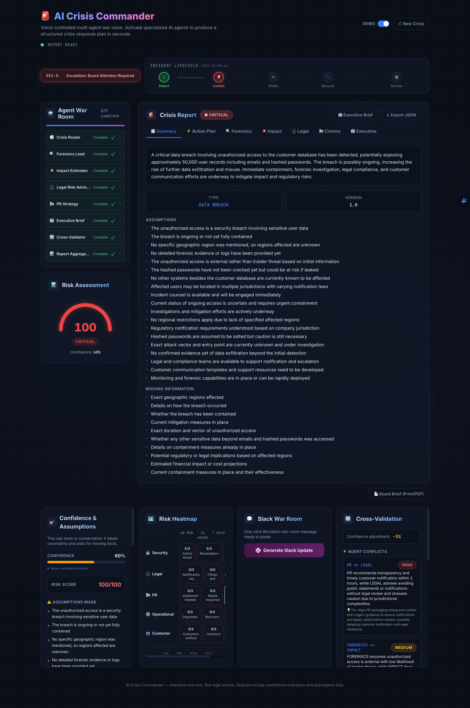 | 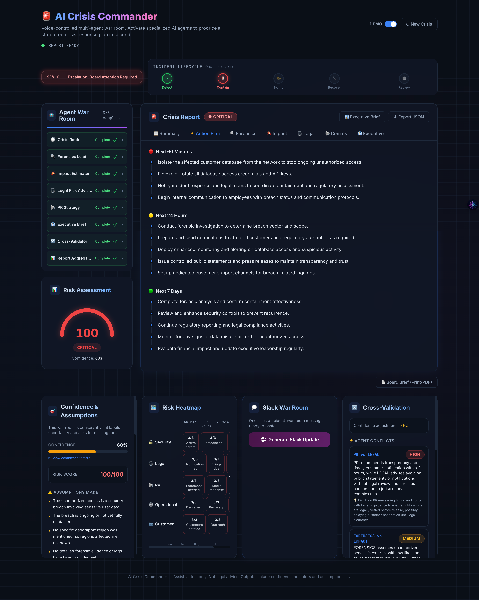 |

| **Forensics** | **Impact Analysis** |
| :---: | :---: |
| 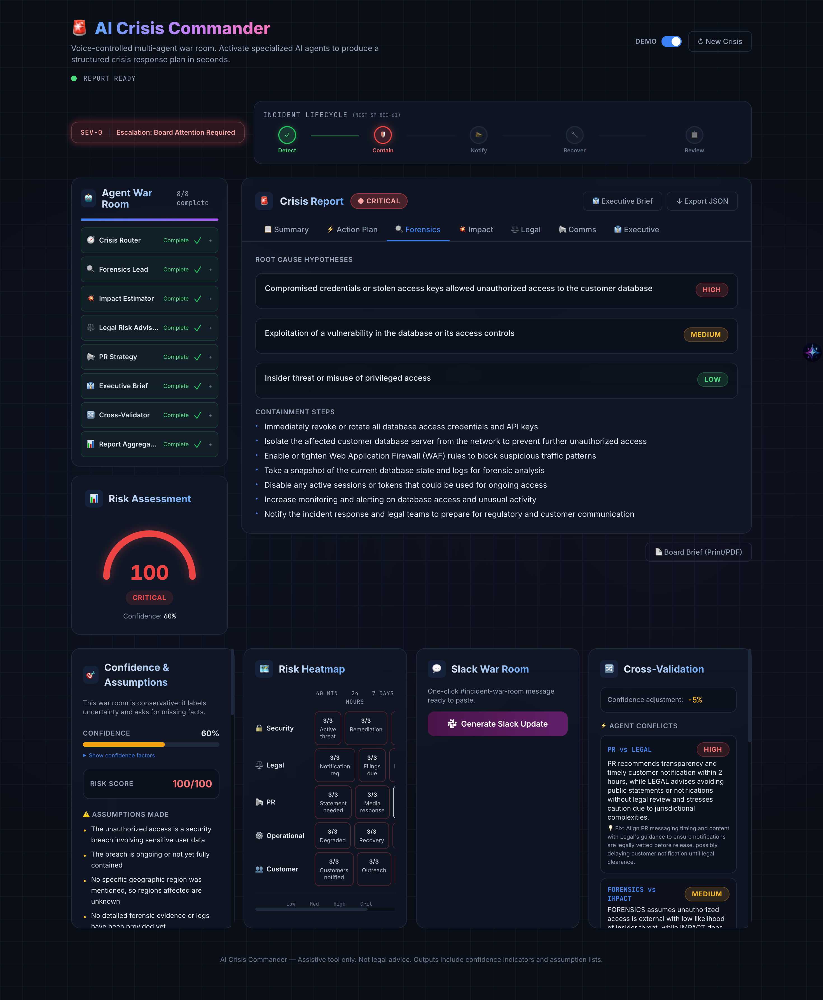 | 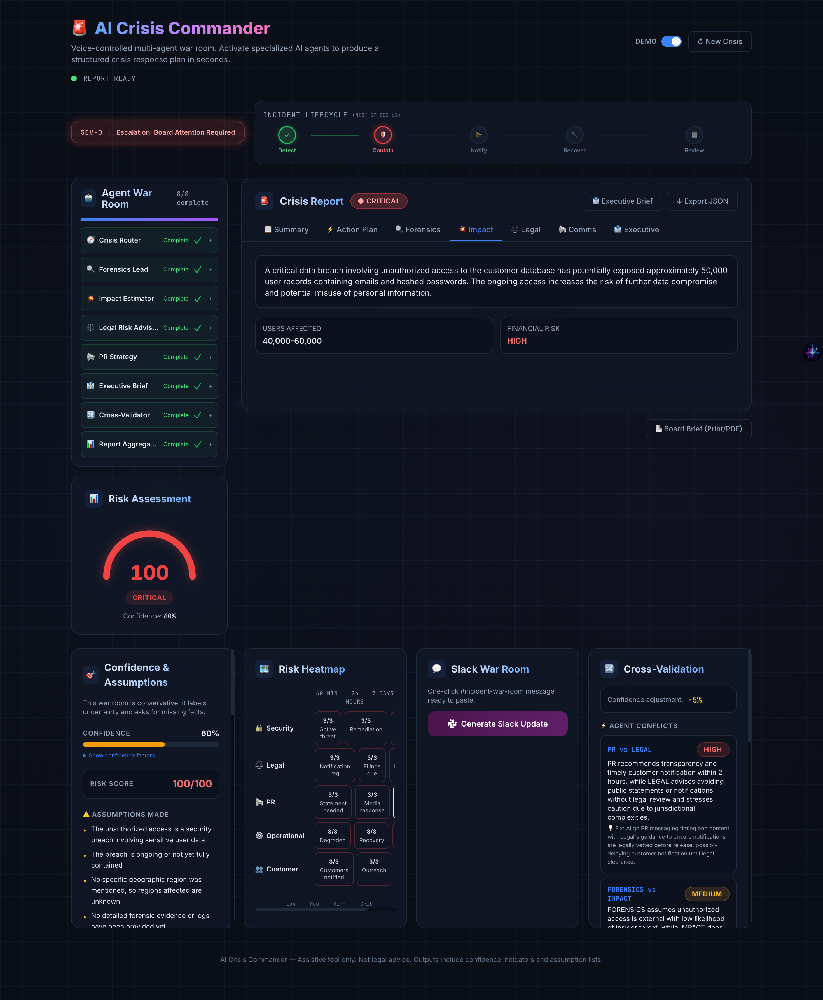 |

| **Legal Options** | **PR Strategy** |
| :---: | :---: |
| 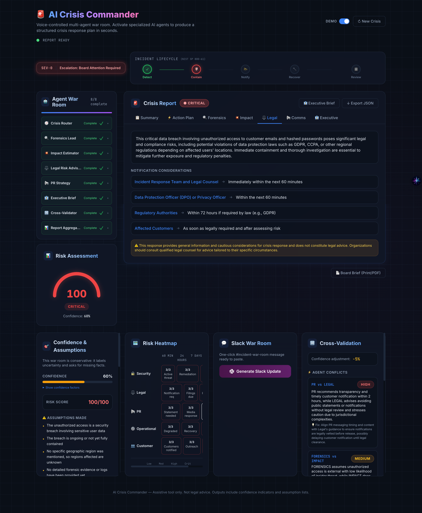 | 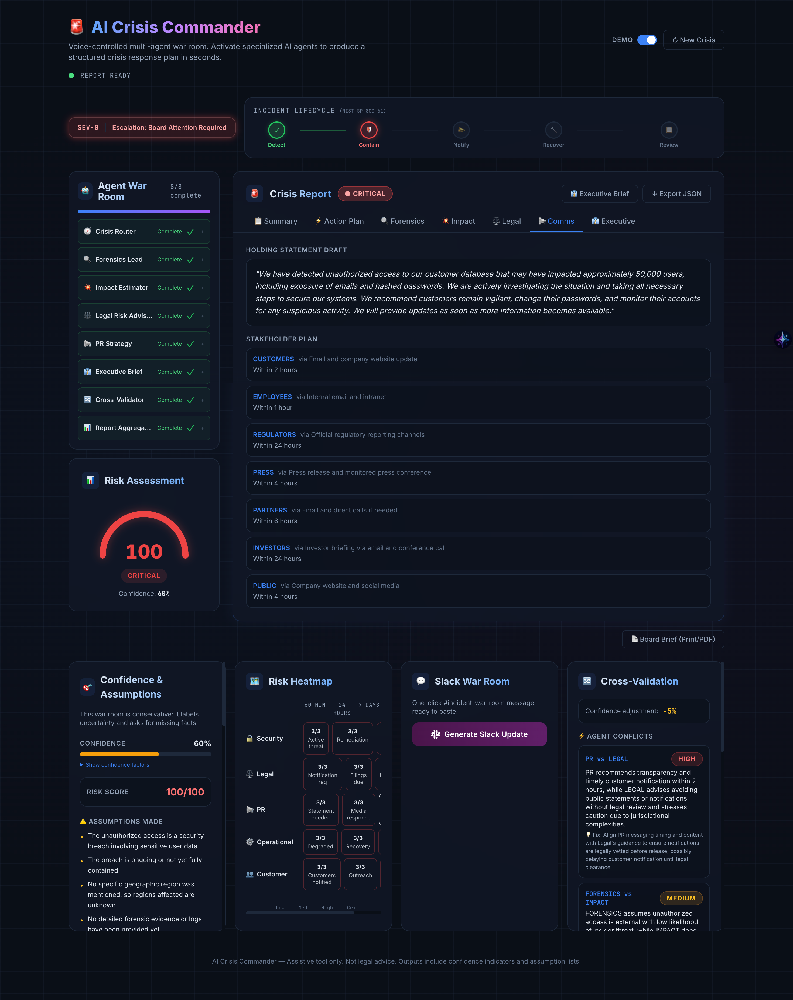 |

### 4. Advanced Risk Analytics
Real-time risk scoring, heatmap analysis, and cross-agent validation.
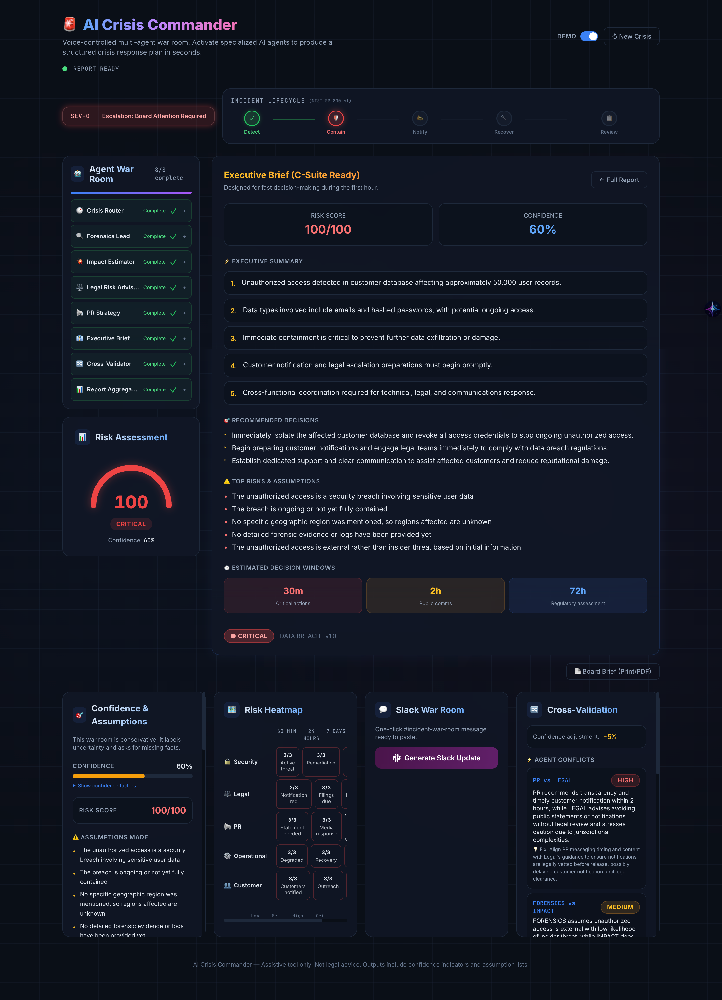

### 5. Executive Brief & Export
A dedicated C-suite view with decision windows (30m / 2h / 72h) and print-ready PDF export.
| **Executive View** | **PDF Export** |
| :---: | :---: |
| 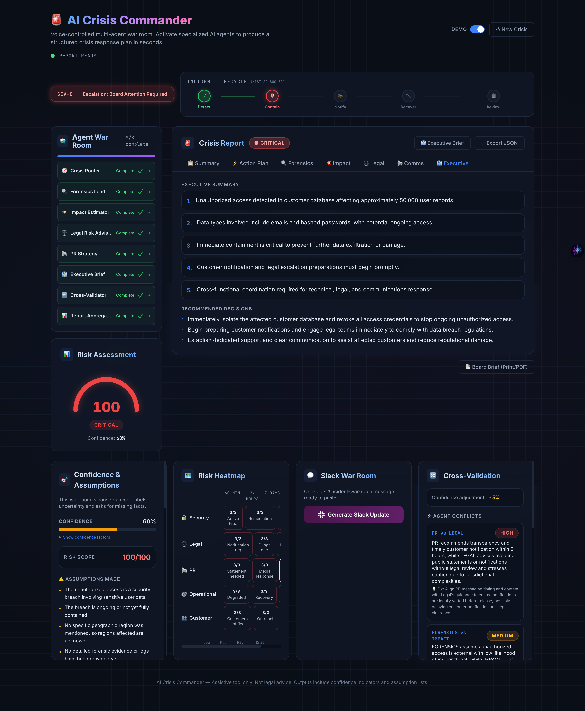 | 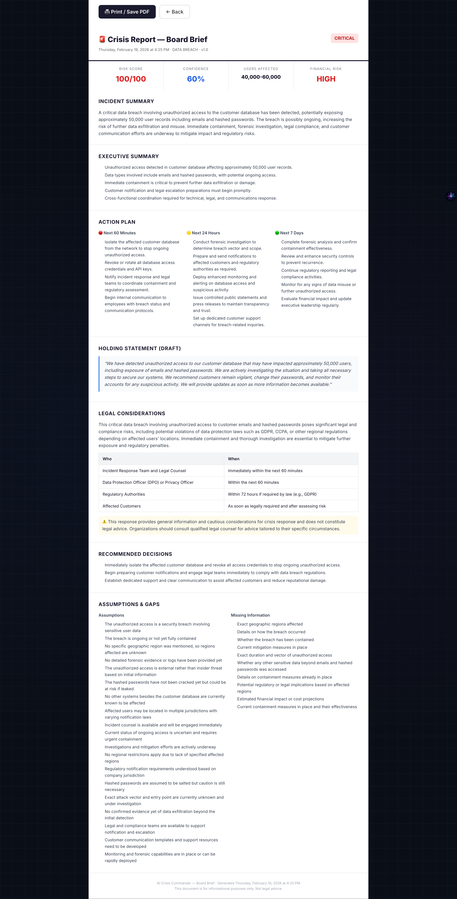 |

---

## 📁 Project Structure

```
ai-crisis-commander/
├── app/                              # Next.js 14 App Router
│   ├── api/
│   │   ├── crisis/route.ts           # Main API — runs full 8-agent pipeline
│   │   └── transcribe/route.ts       # Deepgram speech-to-text
│   ├── brief/page.tsx                # Board brief — print-optimized PDF layout
│   ├── globals.css                   # War-room design system (glassmorphism)
│   ├── layout.tsx                    # Root layout with Inter font
│   └── page.tsx                      # Main war room interface
├── components/
│   ├── AgentStatusPanel.tsx           # Real-time agent status sidebar
│   ├── ConfidencePanel.tsx            # Confidence + factors + "If We're Wrong"
│   ├── CrisisLifecycle.tsx            # NIST SP 800-61 timeline
│   ├── CrisisReportView.tsx           # 7-tab report viewer
│   ├── CrosscheckPanel.tsx            # Cross-validation results
│   ├── EscalationBadge.tsx            # SEV-0 to SEV-3 classification
│   ├── RiskGauge.tsx                  # Animated 0-100 risk gauge
│   ├── RiskHeatmap.tsx                # 5×3 category × time grid
│   ├── ScenarioButtons.tsx            # Demo scenario selector
│   ├── SlackMessage.tsx               # Slack war-room message generator
│   └── VoiceRecorder.tsx              # Web Speech API voice input
├── lib/
│   ├── orchestrator.ts                # 8-agent pipeline orchestration
│   ├── youClient.ts                   # YOU.com Express Agent API client
│   ├── deepgram.ts                    # Speech-to-text integration
│   ├── riskScore.ts                   # Deterministic risk + confidence scoring
│   ├── heatmap.ts                     # 5×3 risk heatmap generator
│   ├── slackFormat.ts                 # Slack message template builder
│   ├── schemas.ts                     # Zod schemas for all agent outputs
│   ├── utils.ts                       # JSON parsing, formatting utilities
│   └── prompts/
│       ├── router.ts                  # Crisis classification prompt
│       ├── agents.ts                  # 5 domain expert prompts
│       ├── aggregator.ts              # Report merger prompt
│       └── crosscheck.ts              # Cross-validation prompt + schema
├── architecture.mmd                   # Mermaid architecture diagram
├── .env.local.example                 # Environment template
├── tailwind.config.ts                 # Custom war-room theme
└── package.json
```

---

## 🗺️ Roadmap

### Planned Integrations

| Integration | Description | Status |
|---|---|---|
| **Slack Webhook** | Auto-post to #incident-war-room on crisis detection | Planned |
| **PagerDuty** | Auto-trigger incident with severity mapping (SEV-0→P1) | Planned |
| **SIEM Ingestion** | Splunk / Datadog log ingestion for forensic context | Planned |
| **Regulatory DB** | GDPR, CCPA, HIPAA notification deadline lookup | Planned |
| **Runbook Matching** | Auto-match crisis type to existing SOPs | Planned |
| **Audit Trail** | Immutable decision log with timestamps | Planned |

### Enterprise Readiness

- SSO / SAML authentication
- Role-based access: analyst, manager, executive views
- Data residency controls
- Custom agent training per organization
- API-first architecture for CI/CD pipeline integration

---

## ⚖️ Disclaimer

AI Crisis Commander is an **assistive tool only**. It is not legal advice. All outputs include confidence indicators, assumption lists, and missing information flags to support — not replace — human decision-making.

---

## 📄 License

MIT License — see [LICENSE](./LICENSE)

---

**Built with ❤️ for rapid crisis response.**

**Quick Links:** [Architecture](./architecture.mmd) · [API Route](./app/api/crisis/route.ts) · [Orchestrator](./lib/orchestrator.ts) · [Schemas](./lib/schemas.ts)
